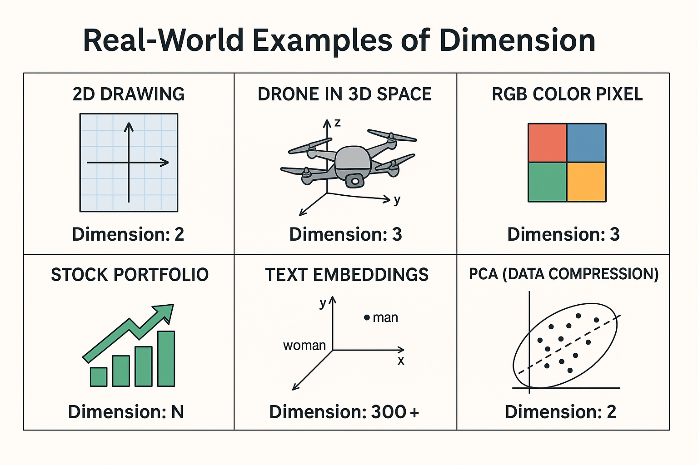

# Chapter 02 – Basis and Dimension

This chapter dives into the ideas of **basis** and **dimension**, which help describe the structure and size of vector spaces.

---

## 1️⃣ What is a Basis?

- A set of **linearly independent** vectors that **span** a vector space.
- Think of it as the minimal set of directions needed to generate the space.

---

## 2️⃣ What is Dimension?

- The number of vectors in any basis of a vector space.
- Equivalent to the number of degrees of freedom in the space.

---

## 3️⃣ Examples and Real-World Intuition

- ℝ² has dimension 2; standard basis: {[1, 0], [0, 1]}
- ℝ³ has dimension 3; basis: {[1, 0, 0], [0, 1, 0], [0, 0, 1]}
- A line through the origin has dimension 1

# ✅ Summary: Real-World Examples of Dimension

| Context                | Object or Representation | Dimension | Notes                                                   |
|------------------------|--------------------------|-----------|---------------------------------------------------------|
| 2D Drawing on Paper    | (x, y) coordinates       | 2         | Two axes (horizontal and vertical) define the space     |
| Drone in 3D Space      | (x, y, z) position       | 3         | Movement in full 3D — 3 degrees of freedom              |
| RGB Color Pixel        | [R, G, B]                | 3         | Red, green, and blue channels define the color vector   |
| Stock Portfolio        | Vector of asset weights  | N         | N stocks = N-dimensional space                          |
| Text Embeddings in NLP | Word vector (e.g. 300D)  | 300+      | Each word is a point in high-dimensional semantic space |
| PCA (Data Compression) | Principal components     | Variable  | Effective dimension is reduced, capturing most variance |

---

## 4️⃣ Summary Table

_To be completed after lessons are explored._