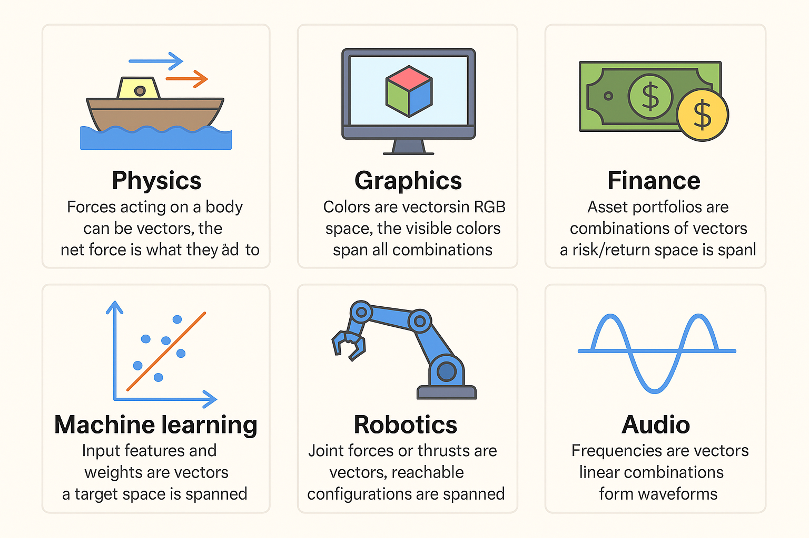

# 📘 Lesson 1: Vectors and Vector Spaces

## ✅ Learning Goals
By the end of this lesson, you should be able to:
- Understand what a vector is (geometrically and algebraically)
- Perform vector addition and scalar multiplication
- Understand linear combinations and span
- Grasp the concept of a vector space
- Identify common vector subspaces like ℝ² and ℝ³

---

## 1️⃣ What is a Vector?

### Algebraic View:
A vector is an **ordered list of numbers** representing a position or direction in space.
- Example:
  $$
  \vec{v} = [3, -1, 2] \in \mathbb{R}^3
  $$
- Algebraically, a vector is like a coordinate list or a directional instruction — but it doesn’t necessarily point to a location unless you define it with respect to the origin. 
- It’s not “where you are”, but “how to move” — 3 units in x, -1 unit in y, 2 units in z.

  
### Geometric View:
A vector can be visualized as an **arrow** from the origin, indicating **magnitude and direction**.

---

## 2️⃣ Vector Operations

### ➕ Vector Addition:
$$
\vec{u} = [1, 2], \quad \vec{v} = [3, -1]
$$

$$
\vec{u} + \vec{v} = [1 + 3, 2 + (-1)] = [4, 1]
$$

### ✖️ Scalar Multiplication:
$$
2 \cdot \vec{v} = 2 \cdot [3, -1] = [6, -2]
$$

---

## 3️⃣ Linear Combinations and Span

- A **linear combination** is any expression like:
  $$
  a_1\vec{v}_1 + a_2\vec{v}_2 + \dots + a_n\vec{v}_n
  $$

- The **span** of a set of vectors is the set of all vectors that can be formed by linear combinations of them.

  Example:
  $$
  \text{Span}(\{[1, 0], [0, 1]\}) = \mathbb{R}^2
  $$

  $$
  \text{Span}(\{[1, 1]\}) = \text{Line through origin at 45°}
  $$
- Example of a vector that lies in a span. \
 $ \vec{v}_1 = [2,1], \vec{v}_2 = [-1,1], \vec{w} = [1,3] $ \
We need to show that $\vec{w} = [1,3] $ is in the span of $ \vec{v}_1 = [2,1], \vec{v}_2 = [-1,1]$ \
so we solve for $a\vec{v}_1 + b\vec{v}_2 = \vec{w}$ \
i.e \
$ a[2,1] + b[-1,1] = [1,3] \:\: which \: gives \: us  \: a=\frac{4}{3} \: and \: b=\frac{5}{3} $ \
this means that $\vec{w}$ is in the span of $\vec{v_1} \: and \: \vec{v_2}$ \
  You can think of it like this:
  If you were standing at the origin and could only walk in the directions of $\vec{v}_1$ and $\vec{v}_2$, then yes — you could reach the point [1, 3] by walking $\frac{4}{3}$ steps in direction $\vec{v}_1$ and $\frac{5}{3}$ in direction $\vec{v}_2.$

  
  

---

## 4️⃣ What is a Vector Space?

A **vector space** is a set of vectors closed under:
- Vector addition
- Scalar multiplication

It must satisfy **8 axioms** (associativity, identity, distributivity, etc.) — these will be explored in a later lesson.

### Common Examples:
- \( \mathbb{R}^n \) (Euclidean spaces)
- Set of all polynomials of degree ≤ n
- 2×2 matrices
- Continuous functions

---

## 5️⃣ Visual Intuition & Real-World Applications

- **Physics**: Displacement, velocity vectors
- **Graphics**: RGB color values as vectors in 3D
- **Finance**: Portfolio weights modeled as vectors

---

## 🧪 Suggested Practice

- Plot vectors using `matplotlib` in 2D and 3D
- Explore vector addition geometrically
- Write Python functions for:
    - Linear combination
    - Vector normalization
    - Span checker (linear dependence check)

---

## 📁 Resources

- `vector_visuals.py` – Python script for plotting
- `vector_visuals.png` – Sample plot images
- [Khan Academy - Vectors](https://www.khanacademy.org/math/linear-algebra/vectors-and-spaces)
- [3Blue1Brown: Essence of Linear Algebra](https://www.youtube.com/playlist?list=PLZHQObOWTQDNPOjrT6KVlfJuKtYTftqH6)

---